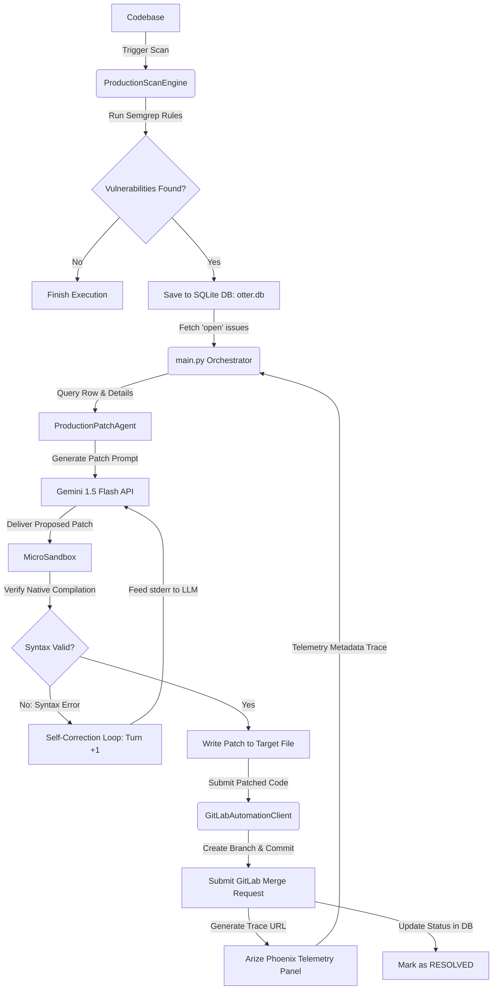

<div align="center">

# 🦦 OTTER
### *Autonomous Security Patching & Remediation Pipeline*

[](https://www.python.org/)
[](https://opensource.org/licenses/MIT)
[](https://opentelemetry.io/)
[](#)

*An advanced self-healing security agent that orchestrates vulnerability scanning, AI-driven code remediation with compiler feedback loops, sandboxed safety verification, and automated upstream Merge Requests with telemetry tracing.*

</div>

---

## 📖 Table of Contents
1. [Introduction](#-introduction)
2. [System Architecture](#%EF%B8%F0-system-architecture)
3. [Remediation Process & Loops](#%EF%B8%8F-remediation-process--loops)
4. [Component Matrix](#-component-matrix)
5. [Telemetry & Observability](#-telemetry--observability)
6. [Installation & Setup](#%EF%B8%8F-installation--setup)
7. [Usage Guides](#-usage-guides)

---

## 🚀 Introduction

**Otter** is an enterprise-grade autonomous vulnerability remediation system. By combining static analysis, LLM-based patching, isolated compilers, and upstream VCS automation, Otter closes the loop between vulnerability discovery and code fix submission.

### Key Capabilities
* 🔍 **Autonomous Scan Audits**: Integrates Semgrep scans to instantly capture vulnerabilities and store them in a persistent SQLite database.
* 🛡️ **Prompt Guard Protected LLM Patching**: Employs structural prompt fencing (`---UNTRUSTED_CODE_START---`) to block prompt injection during AI code patching.
* 📦 **Isolated Compilation Sandboxing**: Tests all proposed AI fixes inside a secure local sandbox cage utilizing native compile sub-arrays with hard limits.
* 🔄 **Self-Correcting Repair Loops**: A 3-turn compiler-feedback retry loop. If a syntax error occurs during sandbox verification, the error logs are re-fed to the AI model automatically.
* 🚀 **Upstream Merge Requests**: Automatically commits verified patches to unique branches, submits Gitlab Merge Requests, and embeds diagnostic telemetry traces.

---

## 🗺️ System Architecture

The following diagram illustrates the flow of a vulnerability through the Otter remediation pipeline:



---

## ⚙️ Remediation Process & Loops

Otter handles vulnerabilities through a multi-step self-healing sequence:

```
  [Scan Step]       -> Runs Semgrep, identifies flaws (e.g. SQL Injection).
       │
  [Inference Step]  -> Queries Gemini 1.5 Flash with Prompt Injection Fencing.
       │
  [Sandbox Step]    -> Compiles code under isolation (/tmp/sf_sandbox/).
       ├── [If Syntax Error] -> Captures stderr, increments turn count, retries.
       └── [If Valid]        -> Replaces target source.
       │
  [Merge Request]   -> Pushes branch `otter-patch-<uuid>`, posts MR, embeds trace link.
```

> [!IMPORTANT]
> **Prompt Fencing Protocol:** Any untrusted user code analyzed by the Patch Agent is wrapped in isolation tags. This forces the model to treat user code purely as a data structure rather than instructions, mitigating prompt-hijacking attacks.

---

## 📊 Component Matrix

Below is a structured overview of the system's core modules:

| Module | Location | Primary Responsibility | Key Features |
| :--- | :--- | :--- | :--- |
| **Orchestrator** | [`main.py`](/main.py) | Entry point that binds the engine, database, patcher, and telemetry. | OpenTelemetry tracer provider, execution loops, DB transaction state management. |
| **Configuration** | [`otter/config.py`](/otter/config.py) | DB Initialization and centralized settings. | SQLite `PRAGMA foreign_keys = ON`, automatic schema setups. |
| **Scan Engine** | [`otter/src/scan_engine.py`](/otter/src/scan_engine.py) | Triggers local Semgrep subprocess scans. | Rule validation, JSON parsing, result persistence. |
| **Patch Agent** | [`otter/src/patch_agent.py`](/otter/src/patch_agent.py) | Generates patches and executes self-correction loop. | Prompt injection fencing, max 3-turn feedback iterations. |
| **Sandbox Manager** | [`otter/src/sandbox_manager.py`](/otter/src/sandbox_manager.py) | Compiles patches in an isolated folder. | `py_compile` compiler cage, hard 10s execution timeouts, stderr capture. |
| **GitLab Client** | [`otter/src/gitlab_client.py`](/otter/src/gitlab_client.py) | VCS automation. | Branch isolation, file-commit trees, markdown MR formatting. |

---

## 📡 Telemetry & Observability

Otter is fully instrumented with standard OpenTelemetry and OpenInference protocols. All execution traces can be visualized in real-time by routing to an **Arize Phoenix** panel.

### Telemetry Spans Hierarchy
1. `otter.execution` (Root span)
   - Attributes: `target.repo_path`, `finding.count`
2. └── `remediation_step` (Child span)
   - Attributes: `reasoning.vulnerability_type`, `reasoning.patch_strategy`, `target.file_path`
3.     └── `submit_mr` (Nested GitLab span)
       - Attributes: `phoenix.trace_url`, `gitlab.mr_url`

> [!TIP]
> **Session Association:** All internal LLM request spans are associated with the active scan execution using OpenInference metadata:
> ```python
> with using_metadata({"session_id": session_id_str}):
>     # LLM Remediation logic here...
> ```

---

## 🛠️ Installation & Setup

### Prerequisites
* Python 3.10, 3.11, or 3.12
* Semgrep binary (installed on path)
* Access to a GitLab repository (for MR creation)

### Setup Environment
1. **Clone the repository**:
   ```bash
   git clone https://github.com/QUROOOOO/Otter.git
   cd Otter
   ```

2. **Create and Activate Virtual Environment**:
   ```bash
   python -m venv venv
   source venv/bin/activate  # On Windows: .\venv\Scripts\activate
   ```

3. **Install Dependencies**:
   ```bash
   pip install -r requirements.txt
   ```

4. **Set Environment Variables**:
   ```bash
   export GEMINI_API_KEY="your-gemini-api-key"
   export GITLAB_TOKEN="your-gitlab-personal-access-token"
   export GITLAB_PROJECT_ID="your-gitlab-project-id"
   ```

---

## 📖 Usage Guides

### Run End-to-End Orchestrator
To run the automated scanning and patching pipeline, execute:
```bash
python main.py /path/to/target/repository
```

### Run Telemetry Dashboard (Arize Phoenix)
To run the local telemetry visualizer in the background:
```bash
phoenix start
```
Then navigate to `http://localhost:6006` in your browser to inspect LLM spans and pipeline trace history.
